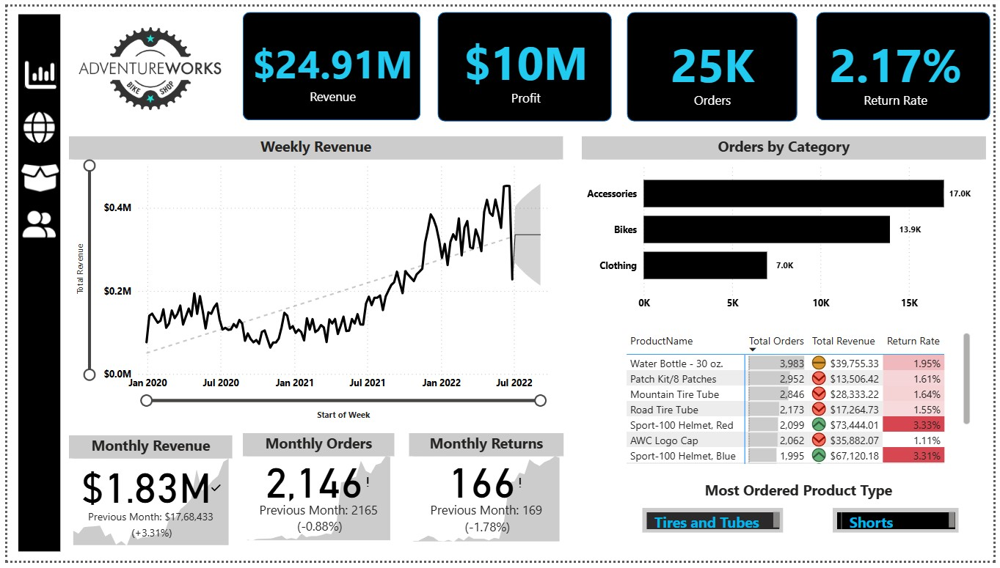
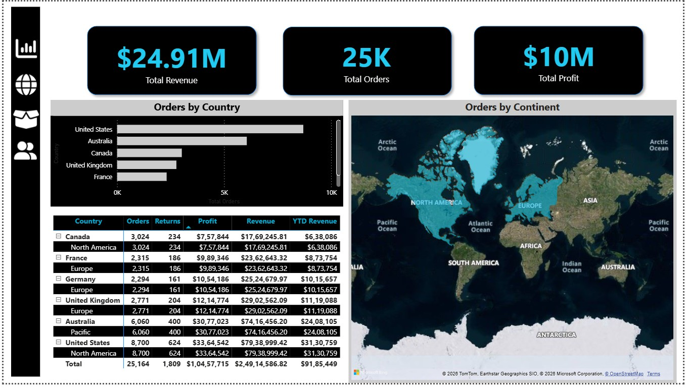
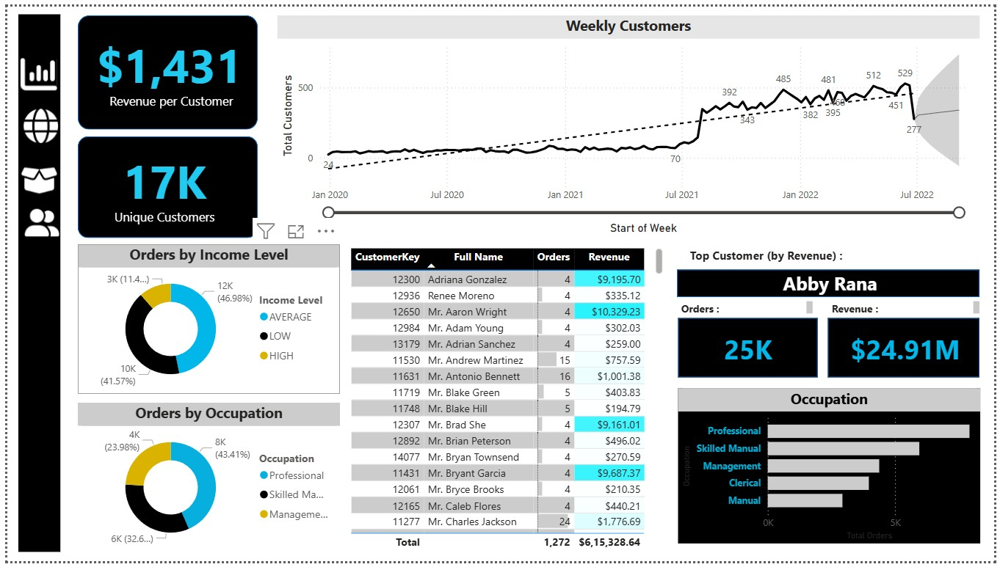

# 📊 Interactive_Sales & Business Performance Analytics Report (Power BI)

An **interactive multi-page Power BI report** built to analyze sales performance, customer behavior, and product insights using data visualization and business intelligence techniques.

This project demonstrates how raw business data can be transformed into **actionable insights using Power BI, DAX measures, conditional formatting, and interactive report design.**

---

# 🚀 Key Business Metrics

| Metric | Value |
|------|------|
| Total Revenue | $24.91M |
| Total Profit | $10M |
| Total Orders | 25K |
| Return Rate | 2.17% |

These KPIs provide a quick overview of overall business performance.

---

# 📊 Report Pages

## Executive Dashboard

The Executive Dashboard provides a high-level overview of business performance including:

- Total revenue, profit, orders, and return rate
- Weekly revenue trends
- Orders by category
- Product return rate insights
- Monthly performance indicators

This page helps stakeholders quickly evaluate overall business health.

---

## Geographic Analysis

This page focuses on **regional sales performance** and includes:

- Orders by country
- Sales distribution by continent
- Country-level revenue and profit analysis
- Regional sales comparisons

This helps businesses identify **high performing markets and geographic opportunities.**

---

## Product Analysis

Product performance analysis includes:

- Monthly orders vs target
- Monthly revenue vs target
- Monthly profit vs target
- Orders by product category
- Category level profit breakdown
- Monthly profit trends

This page highlights **top performing product categories and revenue drivers.**

---

## Customer Insights

Customer analysis provides insights into purchasing behavior including:

- Revenue per customer
- Total unique customers
- Weekly customer growth trends
- Orders by income level
- Orders by occupation
- Top customers by revenue

This page helps understand **customer segments and purchasing patterns.**

---

# ⚙ Technical Implementation

## DAX Measures
Custom **DAX measures** were created to calculate key business metrics including:

- Total Revenue
- Total Profit
- Total Orders
- Return Rate
- Monthly Revenue
- Monthly Orders
- Monthly Returns
- Revenue per Customer

These measures allow dynamic calculations across report filters.

---

## Conditional Formatting
Conditional formatting was used to:

- Highlight product return rates
- Emphasize KPI performance
- Improve visual interpretation of tables and metrics.

---

## Interactive Features

The report includes several interactive Power BI features:

- Multi-page navigation
- Dynamic slicers and filters
- Custom tooltip pages
- Drill-down capabilities
- KPI cards and gauges

These features improve **user experience and data exploration.**

---

# 🛠 Tools & Technologies

- **Power BI**
- **DAX (Data Analysis Expressions)**
- **Data Modeling**
- **Data Visualization**
- **Business Intelligence Reporting**

---

# 🎯 Skills Demonstrated

- Dashboard Design
- Data Visualization
- Business Intelligence Reporting
- Data Modeling
- DAX Calculations
- Analytical Thinking

---

# 📂 Repository Structure
├── README.md
├── dataset
├── pbix-file
│ └── Sales Analytics Report.pbix
├── screenshots
│ ├── executive_dashboard.png
│ ├── geographic_analysis.png
│ ├── product_analysis.png
│ └── customer_analysis.png

---

# 👨‍💻 Author

**Nikesh Penala**

Aspiring **Data Analyst** passionate about using data to generate insights and support business decision-making.

Skills:
- Power BI
- SQL
- Python
- Data Visualization
- Business Analytics

---

⭐ If you found this project useful, consider **starring the repository**.
