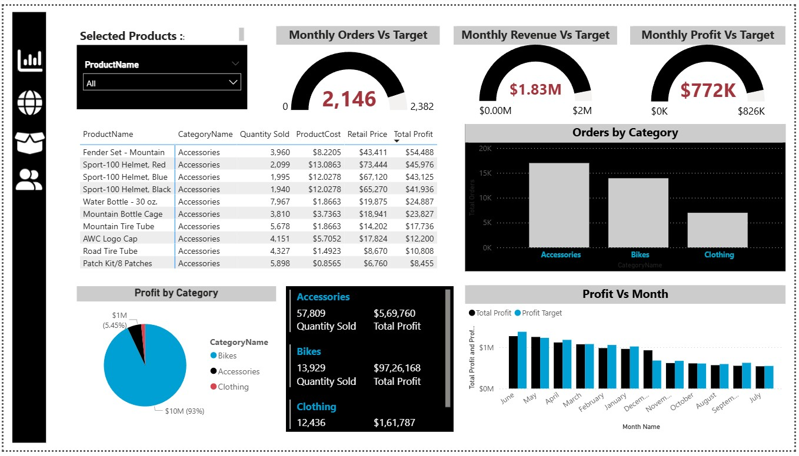

# 📊 Interactive Sales & Business Performance Analytics Report (Power BI)

An interactive **multi-page Power BI dashboard** designed to analyze sales performance, customer behavior, product insights, and geographic trends using modern **Business Intelligence techniques**.

This project demonstrates how **raw business data can be transformed into actionable insights** using **Power BI, DAX measures, conditional formatting, and interactive report design**.

---

# 🎯 Business Problem

Businesses often struggle to quickly understand:

* Which products generate the most revenue
* Which regions perform best
* Customer purchasing behavior
* Return rate trends impacting profitability

This project solves this by building a **fully interactive analytics dashboard** that helps stakeholders monitor performance and make **data-driven decisions**.

---

# 🚀 Key Business Metrics

| Metric        | Value   |
| ------------- | ------- |
| Total Revenue | $24.91M |
| Total Profit  | $10M    |
| Total Orders  | 25K     |
| Return Rate   | 2.17%   |

These KPIs provide a **quick overview of business performance** and help decision makers track growth.

---

# 📊 Report Pages

## Executive Dashboard


The Executive Dashboard provides a **high-level overview of business performance**, including:

* Total revenue, profit, orders, and return rate
* Weekly revenue trends
* Orders by product category
* Product return rate insights
* Monthly performance indicators

This page allows executives to **quickly evaluate overall business health**.

---

## Geographic Analysis


This page focuses on **regional sales performance** and includes:

* Orders by country
* Sales distribution by continent
* Country-level revenue and profit analysis
* Regional sales comparisons

This helps businesses **identify high-performing markets and expansion opportunities**.

---

## Product Analysis



Product performance insights include:

* Monthly orders vs target
* Monthly revenue vs target
* Monthly profit vs target
* Orders by product category
* Category-level profit analysis
* Monthly profit trends

This page highlights **top performing product categories and revenue drivers**.

---

## Customer Insights


Customer behavior analysis includes:

* Revenue per customer
* Total unique customers
* Weekly customer growth trends
* Orders by income level
* Orders by occupation
* Top customers by revenue

These insights help understand **customer segments and purchasing patterns**.

---

# ⚙ Technical Implementation

## Data Modeling

A structured **data model** was created to connect sales, customer, and product tables to enable efficient analysis and filtering.

## DAX Measures

Custom **DAX measures** were developed to calculate key metrics including:

* Total Revenue
* Total Profit
* Total Orders
* Return Rate
* Monthly Revenue
* Monthly Orders
* Monthly Returns
* Revenue per Customer

These measures allow **dynamic calculations across report filters**.

---

## Conditional Formatting

Conditional formatting was used to:

* Highlight product return rates
* Emphasize KPI performance
* Improve visual interpretation of tables and metrics

---

## Interactive Features

The report includes multiple interactive Power BI capabilities:

* Multi-page navigation
* Dynamic slicers and filters
* Custom tooltip pages
* Drill-down functionality
* KPI cards and gauges

These features improve **data exploration and user experience**.

---

# 🛠 Tools & Technologies

* Power BI
* DAX (Data Analysis Expressions)
* Data Modeling
* Data Visualization
* Business Intelligence Reporting

---

# 🎯 Skills Demonstrated

* Dashboard Design
* Data Visualization
* Business Intelligence Reporting
* Data Modeling
* DAX Calculations
* Analytical Thinking

---

# 📂 Repository Structure

```
Interactive-Sales-Analytics-Report-built-using-Power-BI
│
├── pbix-file
│   └── Sales_Analytics_Report.pbix
│
├── screenshots
│   ├── executive_dashboard.png
│   ├── geographic_analysis.png
│   ├── product_analysis.png
│   └── customer_analysis.png
│
└── README.md
```

---

# 👨‍💻 Author

**Nikesh Penala**

Aspiring **Data Analyst** passionate about transforming raw data into actionable insights and building interactive dashboards.

### Skills

* Power BI
* SQL
* Python
* Data Visualization
* Business Analytics

---

⭐ If you found this project useful, consider **starring the repository**.
